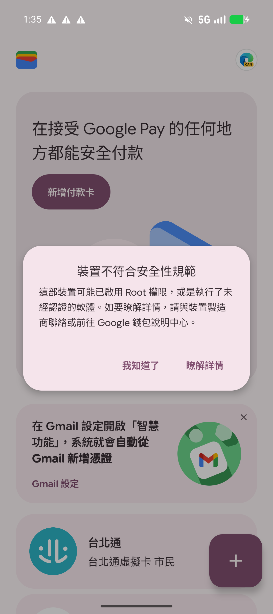

# GrapheneOS App 相容性與微調紀錄

> **設備：** Pixel 9a (tegu) | **更新日期：** 2026-02-25

---

## 應用程式相容性總表

| App 名稱 | 來源 | 狀態 | 關鍵微調 | 備註 |
| --- | --- | --- | --- | --- |
| **Play 服務** | GrapheneOS | 🟡 部分 | 建議授權：通知、聯絡人和帳戶、位置、網路、Sensors |  |
| **Play 商店** | GrapheneOS | 🟡 部分 | 建議授權「通知」給 Play 服務 | 須手動點擊授權安裝 |
| **CUBE** | Play Store | 🔴 閃退 | 無解 | 顯示設備遭破解 |
| **將來銀行** | Play Store | 🟢 正常 | 完美 | 完美運作 |
| **國泰證券** | Play Store | 🟢 正常 | 完美 | 通知依賴 Play 服務 |
| **全支付** | Play Store | 🟢 正常 | 完美 | 通知依賴 Play 服務 |
| **街口支付** | Play Store | 🟡 部分 | SIM 卡驗證失敗，改用交易密碼驗證 | 完全依賴 Play 服務 |
| **一卡通** | Play Store | 🟡 部分 | 需要 Play Integrity | 完全依賴 Play 服務 |
| **悠遊付** | Play Store | 🟢 正常 | 完美 | 「嗶乘車」似乎能用、地圖依賴 Play 服務 |
| **中國信託** | Play Store | 🔴 閃退 | 無解 | 顯示連線有風險 |
| **台灣行動支付** | Play Store | 🔴 閃退 | 閃退、SIM 卡驗證失敗，無解 |  |
| **Line Pay** | Play Store | 🟢 正常 | 完美 | 完美運作 |
| **Line** | Play Store | 🟢 正常 | 完美 | 通知依賴 Play 服務 |
| **Line Bank** | Play Store | 🟢 正常 | 完美 | 完美運作 |
| **Spotify** | Play Store | 🟢 正常 | 可能需要 Play Integrity | 無損音質正常運作、可能不須 Google 服務 |
| **Netflix** | Play Store | 🟢 正常 | 需要 Play Integrity | Widevine: L1（完美）、依賴 Play 服務 |
| **麥當勞** | Play Store | 🔴 閃退 | 無解 | 垃圾 App |
| **Proton Mail** | Apk | 🟢 正常 | 完美 | 完美運作 |
| **Proton Calendar** | Apk | 🟢 正常 | 完美 | 完美運作 |
| **Aurora Store** | Droid-ify (Apk) | 🟢 正常 | 完美 | 完美運作 |
| **Brave Browser** | Droid-ify (Apk) | 🟢 正常 | 完美 | 完美運作 |
| **Fossify\*** | Droid-ify (Apk) | 🟢 正常 | 完美 | 完美運作 |
| **Google 相機** | Play Store | 🟢 正常 | 完美 | 完美運作 |
| **Gboard** | Play Store | 🟢 正常 | 完美 | 完美運作 |
| **Google 翻譯** | Play Store | 🟢 正常 | 完美 | 進階功能依賴 Google App |
| **Google 文件** | Play Store | 🟡 部分 | Play 服務 | 完全依賴 Play 服務 |
| **Google 訊息** | Play Store | 🟡 部分 | 無須調整 | RCS 無法使用 |
| **Google 錢包** | Play Store | 🔴 半殘 | 不支援感應支付 | 會員卡能用 |
||||||
